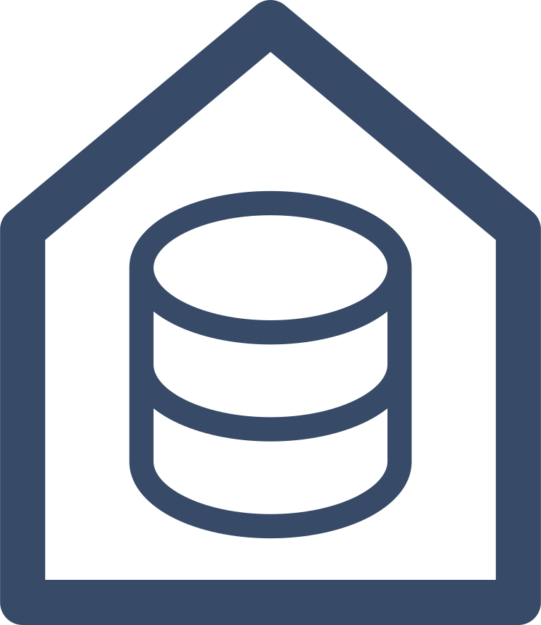
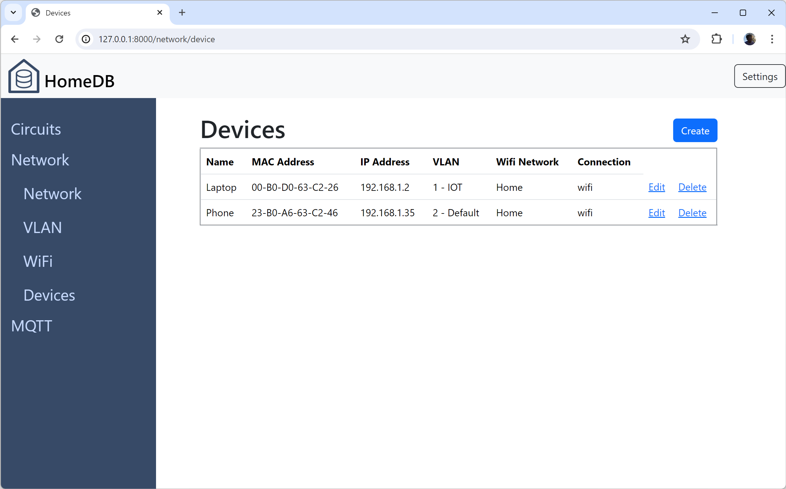

# HomeDB

HomeDB is a Database for the Home. It is built in Django using a Simple sqlite Database and YAML Configuration Stored Locally in the Filesystem.

## Features

- Electrical Circuit
- Network/IP Management
- MQTT Broker Management

## Security

This is a Local Database and is not intended to be used on the Internet. It is intended to be used on a Local Network. 

There has been little thought into the Security of this Database, so beware when storing Sensitive Information, Passwords and Keys.